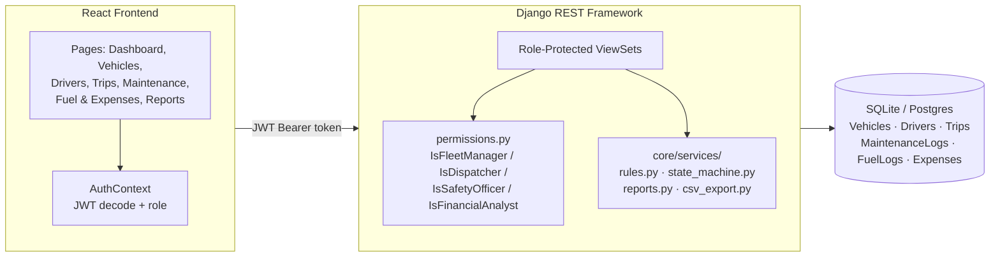

# TransitOps — Smart Transport Operations Platform

**A role-based fleet management platform that replaces spreadsheets and manual logbooks with automated business-rule enforcement, live status tracking, and operational analytics.**

Built in an 8-hour hackathon sprint.


---

## Table of Contents

- [The Problem](#the-problem)
- [What We Built](#what-we-built)
- [Why It Stands Out](#why-it-stands-out)
- [Role-Based Access Control](#role-based-access-control)
- [The 9 Business Rules](#the-9-business-rules)
- [Architecture](#architecture)
- [Tech Stack](#tech-stack)
- [Getting Started](#getting-started)
- [Testing](#testing)
- [Screenshots](#screenshots)
- [Team](#team)

---

## The Problem

Logistics companies running fleets on spreadsheets and manual logbooks hit the same failures on repeat: vehicles double-booked, drivers dispatched on expired licenses, vehicles left in the rotation while sitting in a repair shop, and no real-time answer to "what's our fleet utilization right now?" TransitOps digitizes the full lifecycle — vehicles, drivers, dispatch, maintenance, expenses — and makes those failure modes **structurally impossible**, not just discouraged.

---

## What We Built

| Area | What it does |
|---|---|
| **Authentication** | Username + password login, JWT-based, role embedded in the token |
| **RBAC** | 4 distinct roles, each with a scoped sidebar and server-enforced permissions |
| **Vehicle Registry** | Full CRUD, unique registration number, 4-state lifecycle |
| **Driver Management** | Full CRUD, license expiry tracking, safety score, 4-state lifecycle |
| **Trip Management** | Draft → Dispatched → Completed → Cancelled, automatic status transitions |
| **Maintenance Workflow** | Opening a record pulls a vehicle from dispatch instantly; closing restores it |
| **Fuel & Expense Tracking** | Per-vehicle logs feeding automatic operational cost calculation |
| **Dashboard** | Live KPIs — utilization, active/pending trips, drivers on duty |
| **Reports & Analytics** | Fuel efficiency, operational cost, Vehicle ROI, streaming CSV export |

---

## Why It Stands Out

- **RBAC is enforced on the backend, not faked in the UI.** Every write endpoint checks the requester's role server-side via DRF permission classes — the boundary holds even against a direct API call, not just a hidden button.
- **All 9 mandatory business rules are independently unit-tested.** 36 automated tests covering the rule engine, the trip/maintenance state machine, and the reporting math — including edge cases like "cargo exactly at capacity."
- **Validation failures return all at once, not one at a time.** Dispatch a suspended driver with overweight cargo and get both errors in a single response.
- **CSV export streams instead of buffering** — won't choke on a large trip/fuel history.
- **Seeded with realistic demo data** — 30 vehicles, 30 drivers, varied regions/types/statuses — so the dashboard shows meaningful numbers, not one lonely test record.

---

## Role-Based Access Control

| Role | Sidebar | Can do |
|---|---|---|
| **Fleet Manager** — oversees fleet assets, maintenance, vehicle lifecycle | Dashboard, Vehicles, Maintenance | Full Vehicle CRUD, open/close Maintenance records |
| **Dispatcher** — creates trips, assigns vehicles/drivers | Dashboard, Trips | Create, dispatch, complete, cancel Trips |
| **Safety Officer** — ensures compliance, tracks licenses | Dashboard, Drivers | Full Driver CRUD, license & safety score tracking |
| **Financial Analyst** — reviews costs and profitability | Dashboard, Fuel & Expenses, Reports | Log fuel/expenses, view Reports, export CSV |

Dashboard is shared by every role. Everything else is scoped both in the sidebar **and** on the backend — a Dispatcher's token genuinely cannot create a Vehicle, even via a raw API call.

---

## The 9 Business Rules

All independently unit-tested, all enforced server-side:

1. Vehicle registration number must be unique.
2. Retired or In Shop vehicles never appear in the dispatch selection pool.
3. Drivers with expired licenses or Suspended status cannot be assigned to trips.
4. A vehicle or driver already On Trip cannot be assigned to another trip.
5. Cargo weight must not exceed the vehicle's maximum load capacity.
6. Dispatching a trip sets both vehicle and driver to On Trip.
7. Completing a trip restores both to Available.
8. Cancelling a dispatched trip restores both to Available.
9. Creating active maintenance forces the vehicle to In Shop; closing restores Available (unless Retired).

---

## Architecture



The core business logic (`core/services/`) has **zero Django dependency** — plain Python, unit-tested before the database models even existed, built in parallel with the rest of the team.

---

## Tech Stack

**Backend:** Django 5 · Django REST Framework · `djangorestframework-simplejwt` · `django-filter` · SQLite (dev)
**Frontend:** React · Vite · React Router · Tailwind CSS · Axios · `jwt-decode`
**Testing:** Django `TestCase` — 36 tests spanning pure-Python rule logic, state machine transitions, reporting math, and full end-to-end API calls

---

## Getting Started

```bash
# Backend
cd transitops-odoo
python -m venv venv && source venv/bin/activate   # venv\Scripts\activate on Windows
pip install -r requirements.txt
python manage.py migrate
python manage.py seed_data          
python manage.py createsuperuser
python manage.py runserver

# Frontend
cd transitops_frontend
npm install
npm run dev
```

Accounts are pre-created by a Fleet Manager via Django admin — no self-signup, by design.

---

## Testing

```bash
python manage.py test core.tests core.tests_smoke -v 2
```
```
Ran 36 tests ... OK
```

---

## Screenshots

<!-- Drop images into docs/screenshots/ and uncomment each line below -->

**Login**
<!--  -->

**Dashboard — live KPIs**
<!--  -->

**RBAC — sidebar comparison across roles**
<!--  -->

**Rejected and Successful dispatch **
<!--  -->


**Maintenance — vehicle pulled from dispatch pool**
<!--  -->

**Reports — fuel efficiency, cost, ROI**
<!--  -->

**CSV export**
<!--  -->


---


## Team

- **Backend — models, auth, RBAC, CRUD:** Krishna Priya S
- **Backend — rules engine, state machine, reports, CSV:** Yamini S
- **Frontend — UI, routing, role-aware layout:** Vuyyuru Chandra Hasyatha 