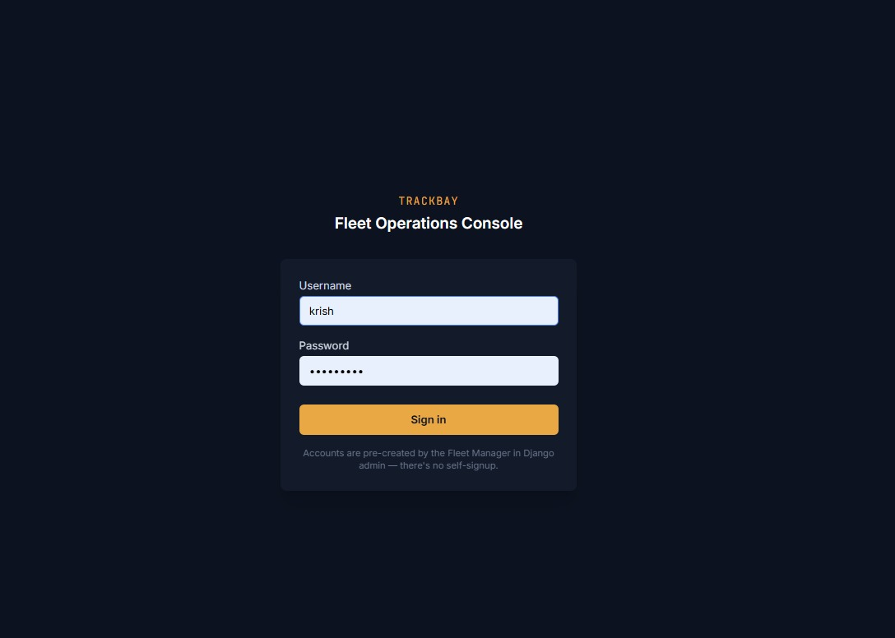
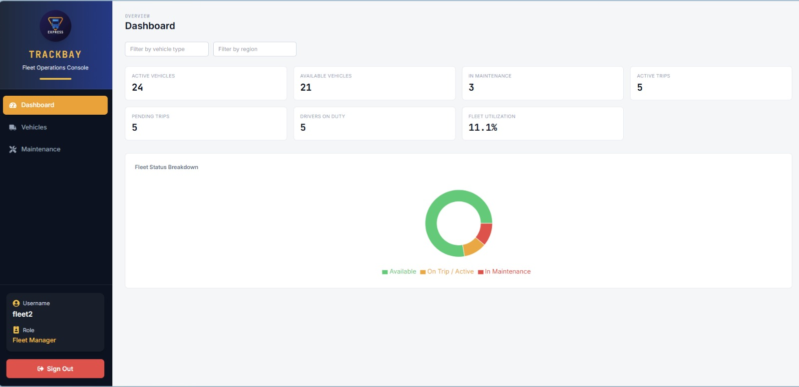
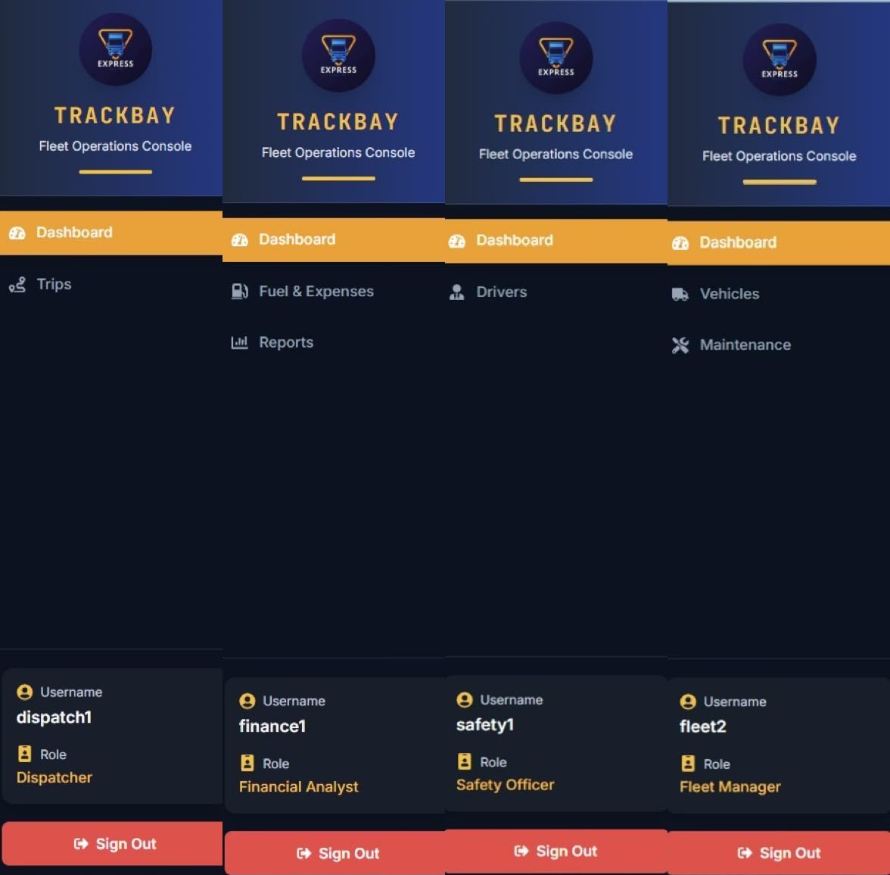
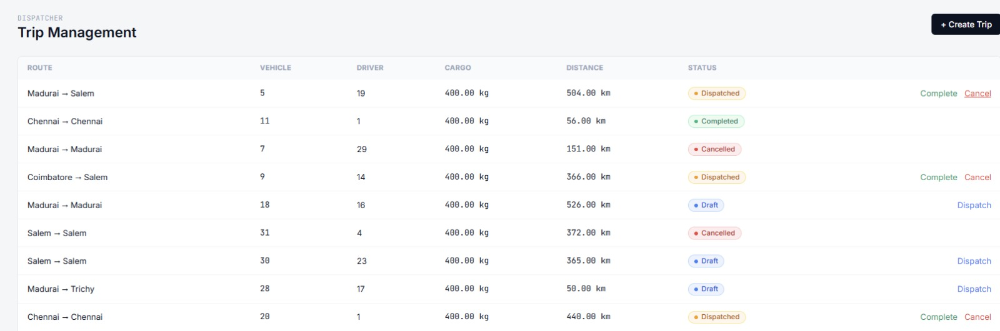
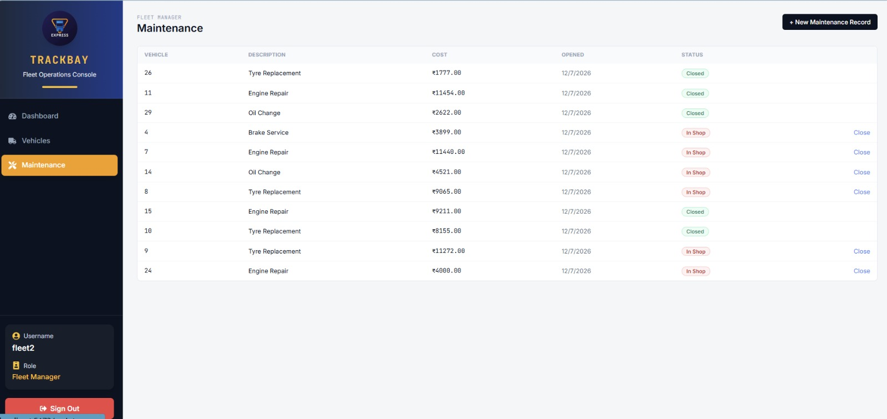
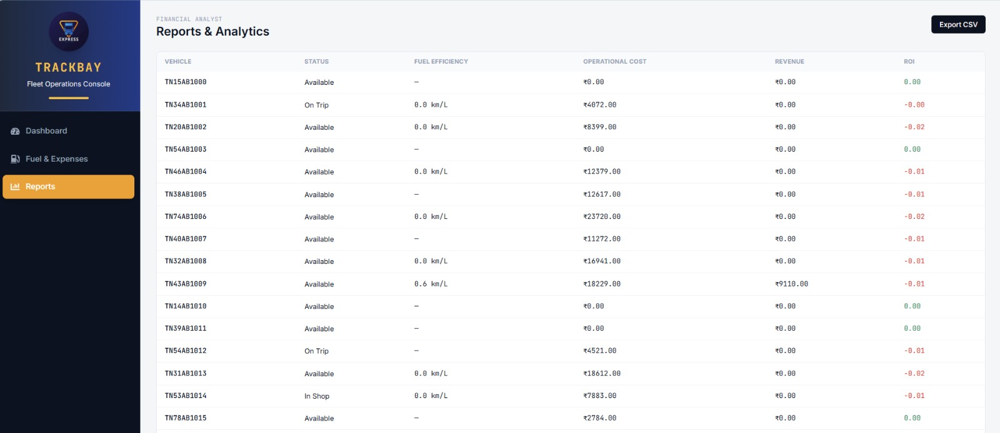
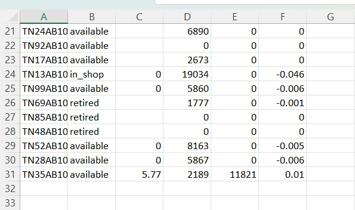

# TrackBay — Smart Transport Operations Platform

**TrackBay** is a role-based fleet management platform that replaces spreadsheets and manual logbooks with automated business-rule enforcement, live fleet tracking, and operational analytics.

🚚 Built during an **8-hour Hackathon**.


---

# Table of Contents

- Problem Statement
- Key Features
- Role-Based Access Control
- Business Rules
- Architecture
- Tech Stack
- Getting Started
- Testing
- Screenshots
- Team

---

# Problem Statement

Fleet and logistics companies often rely on spreadsheets and manual logbooks to manage vehicles, drivers, maintenance, dispatch, fuel usage, and operational expenses. This frequently results in:

- Double-booked vehicles
- Expired driver licenses going unnoticed
- Vehicles dispatched while under maintenance
- Poor visibility into fleet utilization
- Inefficient expense tracking
- Lack of operational insights

**TrackBay** solves these challenges by providing a centralized transport management platform with automated validation, role-based access control, and real-time operational reporting.

---

# Key Features

- 🔐 JWT Authentication
- 👥 Role-Based Access Control (RBAC)
- 🚛 Vehicle Management
- 👨‍✈️ Driver Management
- 📦 Trip Lifecycle Management
- 🛠 Maintenance Workflow
- ⛽ Fuel Log Management
- 💰 Expense Tracking
- 📊 Live Dashboard KPIs
- 📈 Reports & Analytics
- 📄 CSV Export
- ✅ Automated Business Rule Validation

---

# What We Built

| Module | Description |
|---------|-------------|
| Authentication | JWT Login with embedded user roles |
| RBAC | Fleet Manager, Dispatcher, Safety Officer & Financial Analyst |
| Vehicle Registry | CRUD with unique registration validation |
| Driver Management | CRUD with license expiry & safety tracking |
| Trip Management | Draft → Dispatched → Completed → Cancelled |
| Maintenance | Automatic vehicle availability handling |
| Fuel & Expense | Vehicle-wise operational tracking |
| Dashboard | Live KPIs & fleet utilization |
| Reports | Fuel Efficiency, ROI, Operational Cost |
| CSV Export | Export reports in CSV format |

---

# Role-Based Access Control

| Role | Access |
|------|--------|
| Fleet Manager | Dashboard, Vehicles, Maintenance |
| Dispatcher | Dashboard, Trips |
| Safety Officer | Dashboard, Drivers |
| Financial Analyst | Dashboard, Fuel Logs, Expenses, Reports |

Role validation is enforced on the backend using Django REST Framework permission classes.

---

# Business Rules

The system enforces the following rules automatically:

1. Vehicle registration numbers must be unique.
2. Vehicles in **Maintenance** or **Retired** state cannot be dispatched.
3. Suspended or expired-license drivers cannot be assigned.
4. Drivers or vehicles already on an active trip cannot be reused.
5. Cargo cannot exceed vehicle capacity.
6. Dispatch updates both vehicle and driver status to **On Trip**.
7. Completing a trip restores both to **Available**.
8. Cancelling a dispatched trip restores resources.
9. Maintenance automatically updates vehicle availability.

All business rules are independently tested.

---

## Architecture
mermaid
flowchart LR
    subgraph Client["React Frontend"]
        UI["Pages: Dashboard, Vehicles,
Drivers, Trips, Maintenance,
Fuel & Expenses, Reports"]
        Auth["AuthContext
JWT decode + role"]
        UI --> Auth
    end

    subgraph API["Django REST Framework"]
        Views["Role-Protected ViewSets"]
        Perms["permissions.py
IsFleetManager / IsDispatcher /
IsSafetyOfficer / IsFinancialAnalyst"]
        Services["core/services/
rules.py · state_machine.py
reports.py · csv_export.py"]
        Views --> Perms
        Views --> Services
    end

    DB[("SQLite / Postgres
Vehicles · Drivers · Trips
MaintenanceLogs · FuelLogs · Expenses")]

    Client -- "JWT Bearer token" --> API
    API --> DB
The core business logic (core/services/) has **zero Django dependency** — plain Python, unit-tested before the database models even existed, built in parallel with the rest of the team. 

---
# Tech Stack

### Backend

- Django 5
- Django REST Framework
- Simple JWT
- Django Filter
- SQLite

### Frontend

- React
- Vite
- Tailwind CSS
- Axios
- React Router

### Testing

- Django TestCase
- 36 Automated Tests

---

# Getting Started

## Backend

```bash
git clone <repository-url>

cd TrackBay

python -m venv venv

# Windows
venv\Scripts\activate

# Linux / macOS
source venv/bin/activate

pip install -r requirements.txt

python manage.py migrate

python manage.py seed_data

python manage.py createsuperuser

python manage.py runserver
```

## Frontend

```bash
cd frontend

npm install

npm run dev
```

---

# Demo Credentials

Create users from Django Admin.

Example:

| Username | Role |
|-----------|------|
| fleet | Fleet Manager |
| dispatcher | Dispatcher |
| safety | Safety Officer |
| finance | Financial Analyst |

---

# Testing

Run all tests:

```bash
python manage.py test core.tests core.tests_smoke -v 2
```

Expected:

```
Ran 36 tests ... OK
```

---

# Screenshots

## Login



---

## Dashboard



---

## RBAC



---

## Trip Dispatch



---

## Maintenance



---

## Reports



---

## CSV Export



---

# Team

| Member | Responsibility |
|----------|----------------|
| **Krishna Priya S** | Backend – Models, Authentication, RBAC, CRUD APIs |
| **Yamini S** | Backend – Business Rules, Trip Lifecycle, Reports, CSV Export |
| **Vuyyuru Chandra Hasyatha** | Frontend – React UI, Routing, Dashboard, Role-Based Interface |

---

## Built For

**Hackathon Project • TrackBay – Smart Transport Operations Platform**